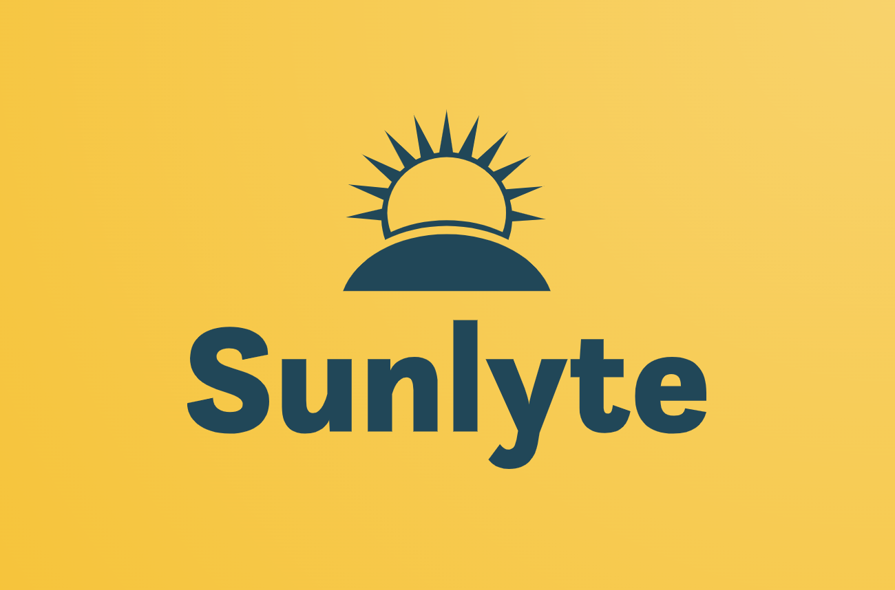
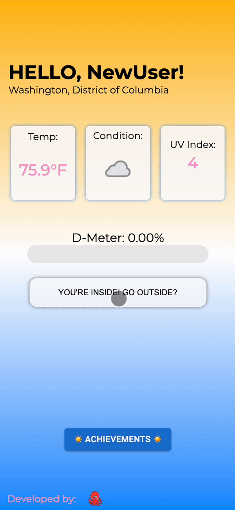
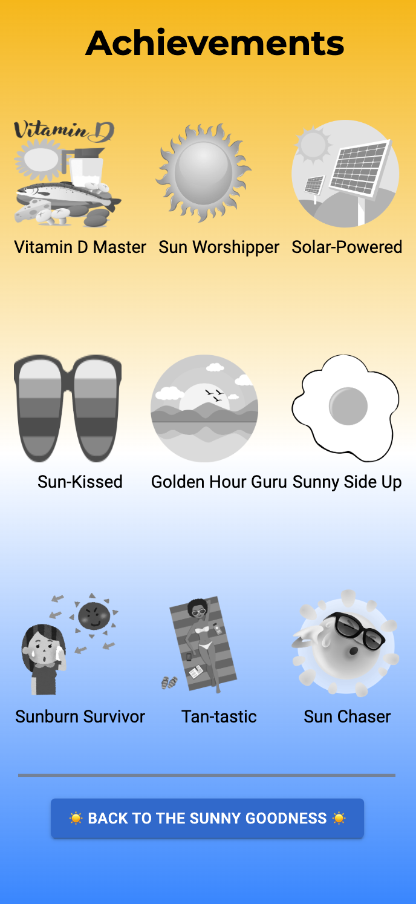

  
 

 

A UV Exposure and Vitamin D Metrics Tracker

 

Sunlyte is a mobile application that uses real time weather data at your current location to measure your recommended sun intake!

 

## Built With

# Overview

Upon logging in, users are greeted with their current local weather conditions, showing temperature, current conditions, and UV index. Users are able to click on the large button in the center of the screen when they go outside, which triggers the D-Meter to fill up with Sunlyte in real time! We've calulated the recommended daily dose of vitamin D and UV exposure so that the meter fills up at different speeds based on the user's local conditions. 

And if the user wants to view their achievements, simply switch to the next tab to keep track of your goals, and to see if you're staying up to par with the recommended daily dose!

 

# Want to Contribute?

Have an idea for how we can improve any of our codebases or libraries? We would love your help! If you would like to contribute, please use the following format:

1. Fork the Github repository into your Github account
2. Clone your forked repository and create a new branch using your Github username as the name of your new branch
3. Commit the changes you'd like to contribute to your branch. Use a detailed description explaining what your code helps to optimize or fix
4. Create a pull request into the main branch of the Sunlyte repository

# Want to Raise an Issue to Our Attention?

You can also raise an issue in Github if you'd like to bring one to our attention. We are genuinely grateful that you'd like to help make our developer tool better. If you'd like to raise an issue, we'd prefer that you use the following format:

1. What is the problem?
2. What did I expect to happen?
3. What have I tried?
4. (If applicable) Why I suspect it's not working

